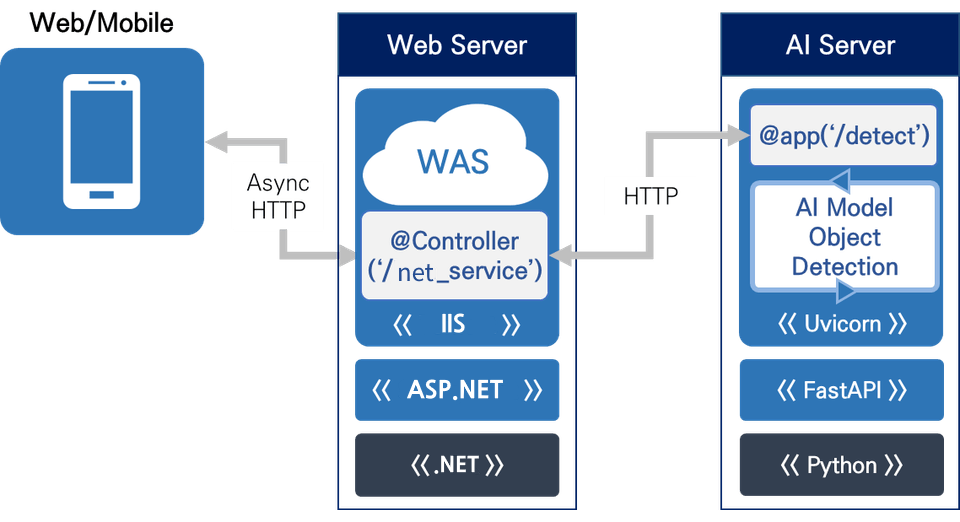
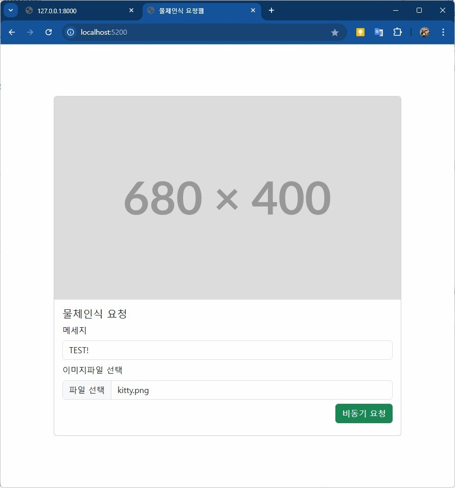
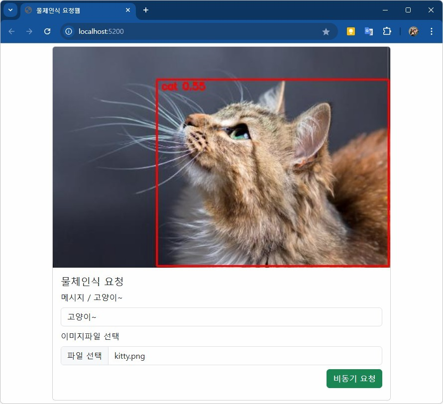
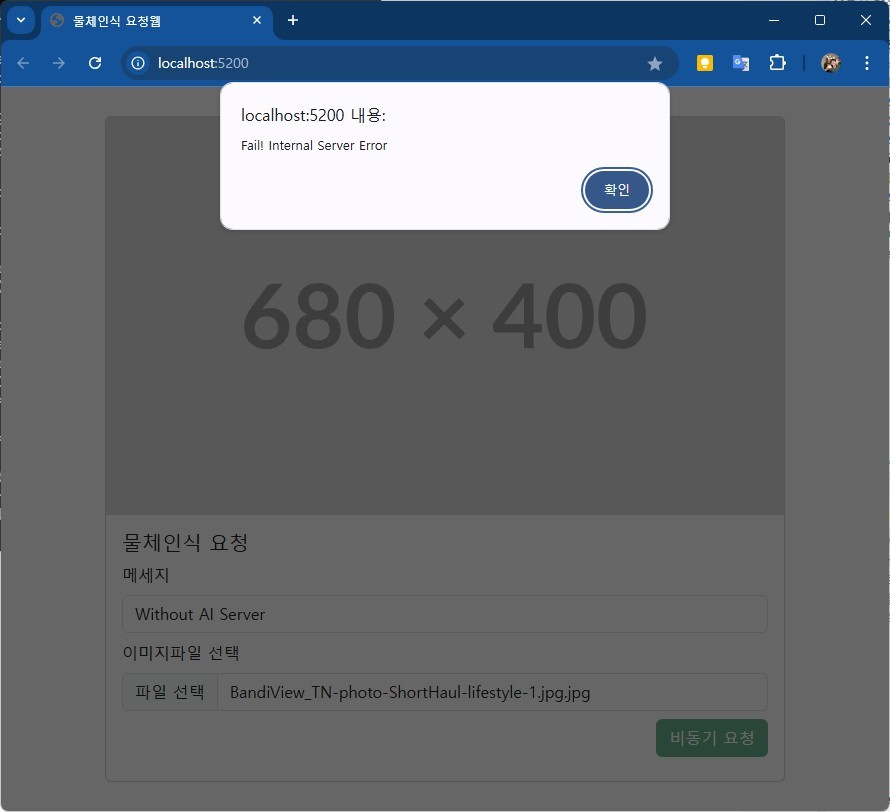
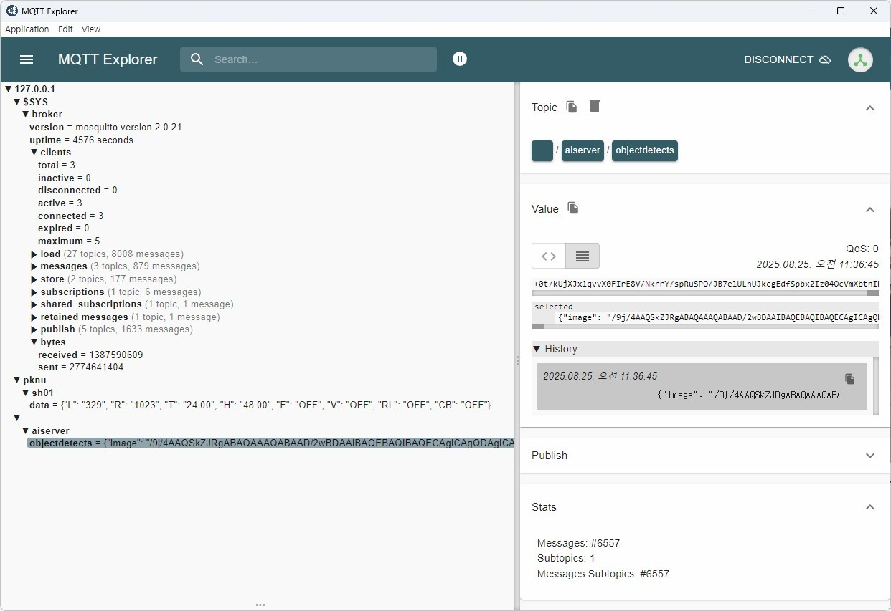
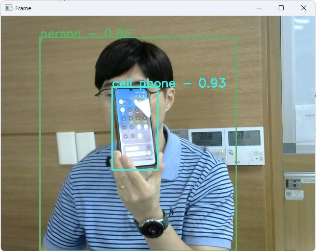
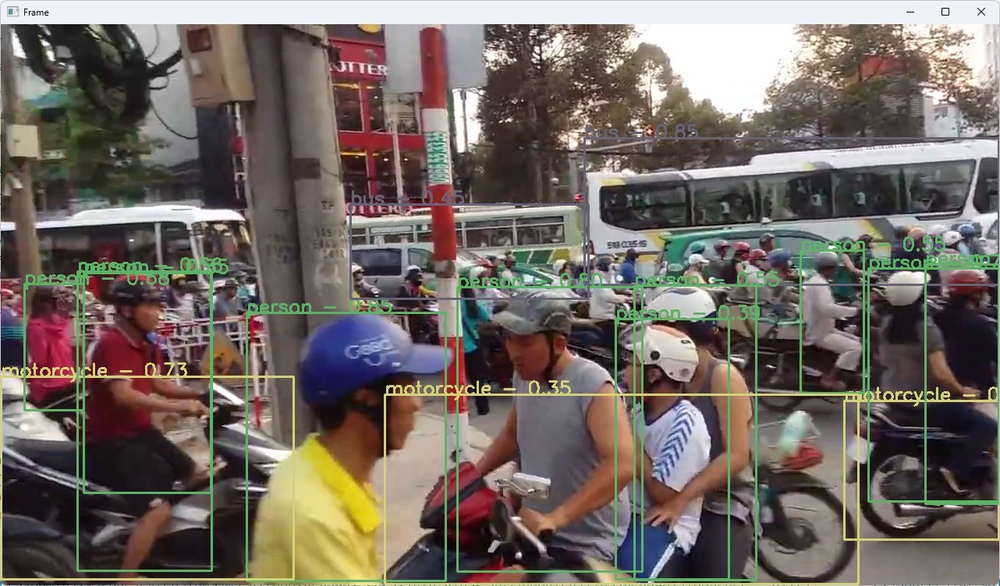
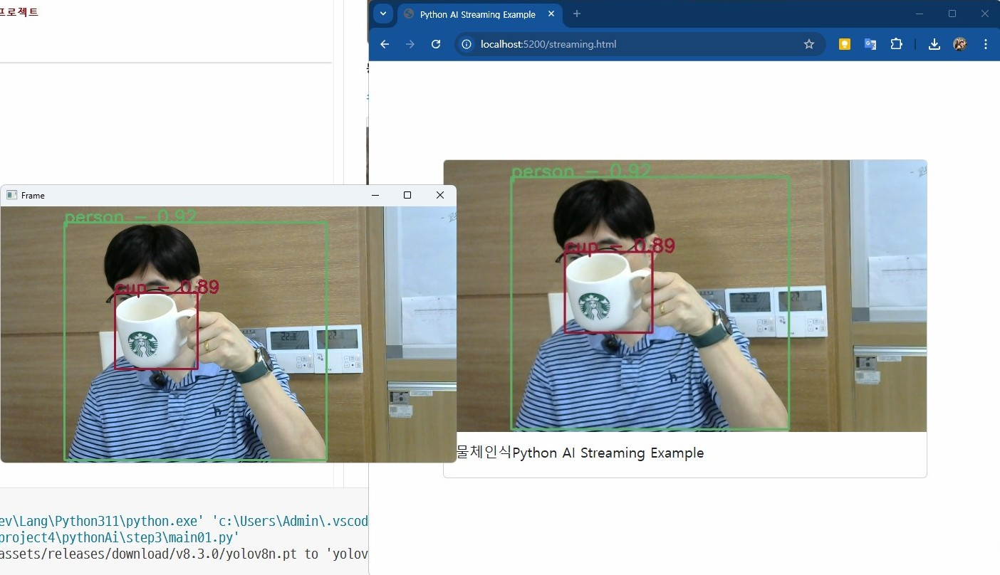

# 미니 프로젝트 4

## 파이썬 AI Server(API동작) + ASP.NET Core 연동 프로젝트

자바 스프링부트 프로젝트와 파이썬 AI 프로젝트 연결하기(허진경 / 부크크)로 학습
[교재링크](https://www.aladin.co.kr/shop/wproduct.aspx?ItemId=343982011&start=slayer)

### python 기본

#### 파이썬 웹애플리케이션
1. dJango : 대규모 웹앱 개발시 사용 프레임워크. 구조화 잘되어 있음. 무겁다
2. flask : 소규모 웹앱 개발시 사용. 가볍다. 필요 개발을 개발자가 모두 구현
3. `uvicorn` : 진짜 소규모 웹앱 개발 사용. FastAPI랑 연동. 무지 가볍다

#### FastAPI
- RESTful API를 손쉽게 만들어주는 웹 프레임워크
- uvicorn 웹앱 프레임워크와 같이 사용

#### 기본 패키지 설치

```shell
> pip install fastapi uvicorn
```

[소스](./pythonAi/step1/main01.py)

#### 데이터 유효성검사 패키지 pydantic

[소스](./pythonAi/step1/main02.py)

#### 전체 통합

[소스](./pythonAi/step1/main03.py)

### ASP.NET Core 기본
- 파이썬에서 만들어져서 uvicorn으로 전달되는 데이터를 수신받아서 표현하는 웹앱
- `ASP.NET Core 비어있음`으로 생성. MVC로 생성 시 필요없는 파일이 다수 생성
- HTTPS를 선택 해제

[소스](./backend/ASPWebSolution/TestWebApp/Program.cs)

#### 파이썬 웹서버 송신 데이터 처리
- html에서 javascript로 처리
- ASP.NET Core API 경유 처리

### 파이썬 AI Server 구현

#### 필요 라이브러리
- fastapi
- uvicorn
- pydantic
- Pillow : 이미지 열기, 저장 라이브러리
- numpy : 수치 연산
- requests : HTTP로 요청
- opencv-python : 이미지, 비디오 처리
- python-multipart : 멀티파트(이미지, 비디오) 파싱

```shell
> pip install Pillow numpy requests opencv-python python-multipart
```

- ultralytics : YOLO 이미지, 동영상 객체탐지. 
    - ultralytics 를 먼저 설치하면 Pytorch CPU버전이 설치
    - YOLO 3까지는 독자적 개발, YOLO 5부터 Ultralytics가 인수 운영 중

- Pytorch GPU 사용버전 설치(2.9GB)

```shell
> pip install torch torchvision --index-url https://download.pytorch.org/whl/cu126
```

- ultralytics 설치

```shell
> pip install ultralytics
```



#### AI Server

- 웹서버 실행

[소스](./pythonAi/step2/main01.py)

#### 이미지 객체 탐시 앱 추가

- ASP.NET에서 전달된 이미지를 객체인식 한뒤 다시 응답하는 웹서비스
- 웹서버 + YOLO객체 탐지

[소스](./pythonAi/step2/main02.py)

#### ASP.NET Core 웹페이지

- 이미지를 AI Server로 전달하고 결과를 돌려받는 웹사이트
- index.html 작업

[소스](./backend/ASPWebSolution/ASPWebApp/wwwroot/index.html)



기본 웹 화면

- API controller 작업
    - net_service API 컨트롤러 구현

[소스](./backend/ASPWebSolution/ASPWebApp/Controllers/NetServiceController.cs)

실행결과1



실행결과2

https://github.com/user-attachments/assets/7247e205-88d7-4ffb-b224-1b269bae3e6b

AI Server 미실행 시



##### 주의점
- index.html의 form태그 내 input은 전부 name이 필요함. Javascript의 입력값 수집객체 FormData() 에서 name 속성 사용함
- `xhr.open('POST', 'http://localhost:5200/net_service', true);`에서 쓰이는 API NetController 작성 필요


### 실시간 웹캠/동영상 물체인식
- 여기서는 uvicorn와 FastApi의 웹서비스 사용하지 않음
- MQTT 웹소캣을 통해서 물체인식하는 실시간 웹캠이나 동영상을 전달하는 예제

#### MQTT 브로커 설정 추가
- 웹소켓 연결을 위해서 MQTT 브로커 서버에 추가 설정필요

```c
# 기본 MQTT
listener 1883
protocol mqtt

# WebSocket용
listener 9001
protocol websockets
```

#### 파이썬 AI 작성
- 웹캠 및 동영상 분리
- 이미지의 경우 base64로 인코딩되어 프레임별로 MQTT 브로커로 전달됨



##### 웹캠

[소스](./pythonAi/step3/main01.py)



##### 동영상

[소스](./pythonAi/step3/main02.py)




#### ASP.NET Subscribe Server
- 이전 소스에서 Program.cs 수정 및 streamming.html만 작성

[소스](./backend/ASPWebSolution/ASPWebApp/Program.cs)
[소스](./backend/ASPWebSolution/ASPWebApp/wwwroot/streaming.html)

웹캠 결과화면



동영상 결과화면

<!-- https://github.com/user-attachments/assets/70a96e30-6dc5-4077-a345-a8ef56810652 -->


#### 추가내용
- yolov8n.pt, yolov8m.pt, yolov9c.pt 중 yolov8n.pt가 처리속도 빠름

| 모델 이름        | 설명          |  특징           |
| ------------ | ----------- |  ------------ |
| `yolov8n.pt` | **Nano 모델** | 가장 작고빠름, 속도 우선        |
| `yolov8s.pt` | Small       | 적당한 속도, 범용           |
| `yolov8m.pt` | Medium      | 정확도 ↑ 느림      |
| `yolov8l.pt` | Large       | 고성능 느림      |              |
| `yolov8x.pt` | Xtreme      | 가장 느림. 연구용 or 서버 전용 |
| `yolov9c.pt` | Compact   | 작은 모델, 빠름    |
| `yolov9e.pt` | Efficient | 정확도/속도 밸런스   |
| `yolov9s.pt` | Small     | YOLOv8s보다 향상 |
| `yolov9m.pt` | Medium    |              |
| `yolov9l.pt` | Large     |              |
| `yolov9x.pt` | Xtreme    | 최고 정확도       |
